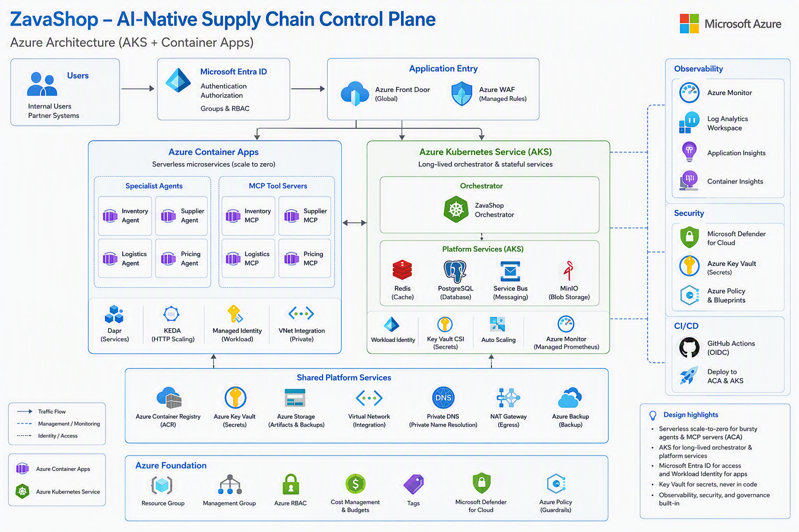

# Deploy a **GitHub Copilot Custom Coding Agent** application to Azure



> You have just been handed a finished multi-agent application. It was **not** written by hand — a team of six **GitHub Copilot Custom Coding Agents** produced the specs, the agent code, the MCP servers, the tests, the Bicep, and the Helm chart. Your job is the next part: **get it running on Azure, fast, and safely.**
>
> Stack: **Microsoft Agent Framework (MAF)** + **GitHub Copilot SDK** (`gpt-5.5`) + **Azure Container Apps** + **AKS** + **Microsoft Entra ID** + **Microsoft Defender for Cloud**.

🇨🇳 [中文版](./README.zh.md)

---

## 🎬 The situation

A partner team used GitHub Copilot Custom Coding Agents to build **ZavaShop**, an AI-native retail supply-chain control plane. The code is complete, typed, tested, and containerised. What it has never had is an Azure home.

You are the platform engineer. Four labs, one afternoon, from `git clone` to a live control plane behind Entra ID, Workload Identity, Key Vault, and Defender for Cloud.

**These labs do not ask you to generate code.** The application under `src/` is the deliverable you received. You read it, you package it, you deploy it, you operate it.

| # | Lab | Time | Outcome |
|---|---|---|---|
| 01 | [Deployment Foundation](./labs/lab-01-deployment-foundation/README.md) | ~60 min | Take delivery of the app, run the fleet locally with Docker Compose, and lay the Azure foundation every later deployment depends on: RG, ACR, Log Analytics, UAMI, Entra group, Key Vault, Defender, GitHub OIDC |
| 02 | [Deploy to Container Apps](./labs/lab-02-deploy-container-apps/README.md) | ~60 min | Build 10 images with ACR Tasks and deploy 8 services to **Azure Container Apps** through one reusable **Bicep** module |
| 03 | [Deploy the AKS Cluster](./labs/lab-03-deploy-aks-cluster/README.md) | ~75 min | Provision a landing-zone-shaped **AKS** cluster: **Microsoft Entra ID** + Azure RBAC, Workload Identity, Key Vault CSI, Azure Policy, Defender — then read and render the **Helm** chart |
| 04 | [Deploy to Production](./labs/lab-04-deploy-production/README.md) | ~75 min | The real release: gates → `what-if` → **Bicep** to ACA → **Helm** to AKS → smoke → evals → secret-less GitHub Actions CD → Day-2 rollout and rollback |

Every lab has a Chinese mirror at `README.zh.md` in the same folder.

### What flows between the labs

The labs are chained by two git-ignored files at the repo root. Every lab starts by sourcing them, so run the labs in order.

| File | Written by | Contains | Consumed by |
|---|---|---|---|
| `.env.lab` | Lab 01 Step 13, appended by Lab 02 Step 6 and Lab 03 Step 4 | `RG`, `ACR`, `LAW`, `KV`, `UAMI_*`, `AKS_ADMINS_GROUP_ID`, `CAE_ID`, `AKS_OIDC`, `AKS_ID` | Labs 02, 03, 04 |
| `.env.fqdns` | Lab 02 `deploy.sh`, refreshed by Lab 04 | `ZAVA_*_URL` for the 4 specialists and 4 MCP servers | Labs 03, 04 (Helm values + `/plan`) |

Neither file holds a secret — the Copilot token lives only in Key Vault. Lab 01 adds both to `.gitignore` and asserts they are untracked.

---

## 🛍 What ZavaShop is

**ZavaShop** is a fast-growing global retailer with 500+ stores. Their supply chain runs on a mix of legacy ERPs, supplier portals, and ad-hoc spreadsheets. The application you received is their AI-native control plane — a fleet of cooperating agents:

| Application agent | Responsibility | Runtime |
|---|---|---|
| `OrchestratorAgent` | The "store manager" — routes a goal to the specialists and merges their answers into one plan | **AKS** — cluster in Lab 03, workload in Lab 04 |
| `InventoryAgent` | Monitor stock-out risk across stores and warehouses | **ACA** (Lab 02) |
| `SupplierAgent` | Draft purchase orders through MCP-backed supplier tools | **ACA** (Lab 02) |
| `LogisticsAgent` | Plan shipments, track ETAs, re-route on disruption | **ACA** (Lab 02) |
| `PricingAgent` | Recommend dynamic pricing from demand + competitor signals | **ACA** (Lab 02) |

Each specialist reaches its backend capability through a dedicated **MCP server** (`inventory-mcp`, `supplier-mcp`, `shipping-mcp`, `pricing-mcp`) so the model never owns business state.

| Layer | Services | Runtime | Ports and probes |
|---|---|---|---|
| Orchestration | `orchestrator` | AKS + Helm (Lab 03 → Lab 04) | Uvicorn on `8000`; `/healthz`, `/readyz`, `/plan`, `/invoke` |
| Specialists | `inventory`, `supplier`, `logistics`, `pricing` | Azure Container Apps (Lab 02) | Uvicorn on `8000`; `/healthz`, `/readyz`, `/invoke` |
| MCP tools | `inventory-mcp`, `supplier-mcp`, `shipping-mcp`, `pricing-mcp` | Azure Container Apps (Lab 02) | FastMCP on `8080`; `/healthz`, `/readyz`, `/mcp` |

Images are tagged with the short git SHA and built through ACR Tasks for `linux/amd64`. **No `:latest` anywhere.** The labs keep ACA services at `minReplicas=1` so smoke tests and live evals are reliable; a production landing zone can revisit private ingress and scale-to-zero once DNS, network, and cold-start budgets are designed.

### The business scenario used throughout

> Store `store-101` will stock out of SKU `ZS-1042` by Friday. Produce a plan.

One `POST /plan` to the orchestrator fans out to four specialists, each of which calls its MCP server, and returns a merged plan with `stock_view`, `po_view`, `shipping_view`, `price_view`, `summary`, and `next_actions`. That single call is the acceptance test for the whole deployment.

---

## 🏗 Target architecture

```
┌──────────────────────────────────────────────────────────────────────────────┐
│ Security + identity guardrails                                               │
│                                                                              │
│  Microsoft Entra ID + Azure RBAC                                             │
│  - GitHub Actions OIDC -> UAMI (no client secret in the repo)     Lab 01     │
│  - Key Vault GITHUB-TOKEN -> keyVaultUrl secret on ACA            Lab 02     │
│  - AKS Entra ID + Azure RBAC, Workload Identity, KV CSI           Lab 03     │
│                                                                              │
│  Microsoft Defender for Cloud                                                │
│  - Defender Containers + KeyVaults plans set to Standard          Lab 01     │
│  - AKS Defender profile + Azure Policy add-on                     Lab 03     │
│  - All of the above re-asserted as a hard release gate            Lab 04     │
└──────────────────────────────────────────────────────────────────────────────┘
                                      │
                                      ▼
┌──────────────────────────────────────────────────────────────────────────────┐
│ AKS      cluster built in Lab 03  ·  orchestrator rolled out in Lab 04       │
│  OrchestratorAgent (MAF Workflow + GitHub Copilot SDK)                       │
│  ServiceAccount: orchestrator-sa + azure.workload.identity/use=true          │
│  Routes: /healthz, /readyz, /plan, /invoke                                   │
└─────────────────────────────────────┬────────────────────────────────────────┘
                                      │ A2A / HTTP (/invoke)
                                      ▼
┌──────────────────────────────────────────────────────────────────────────────┐
│ Azure Container Apps specialists      deployed in Lab 02 · re-rolled Lab 04  │
│  inventory  | supplier  | logistics  | pricing                               │
│  Routes: /healthz, /readyz, /invoke                                          │
└─────────────────────────────────────┬────────────────────────────────────────┘
                                      │ Copilot SDK remote MCP over HTTP
                                      ▼
┌──────────────────────────────────────────────────────────────────────────────┐
│ Azure Container Apps MCP servers      deployed in Lab 02 · re-rolled Lab 04  │
│  inventory-mcp | supplier-mcp | shipping-mcp | pricing-mcp                   │
│  Routes: /healthz, /readyz, /mcp                                             │
└──────────────────────────────────────────────────────────────────────────────┘
```

### Entra ID and Defender for Cloud in the architecture

These controls sit around the fleet rather than inside the retail business logic. Lab 01 and Lab 03 provision them; Lab 04 re-checks them as a hard gate before workloads roll forward.

| Control | Where it appears | What it protects |
|---|---|---|
| Microsoft Entra ID for AKS | Lab 03 creates the cluster with `--enable-aad --enable-azure-rbac`. Human access is Entra ID + Azure RBAC — never admin kubeconfig. | Prevents unmanaged local cluster credentials from becoming the normal operator path. |
| GitHub Actions OIDC | Lab 01 creates the federated credential; the workflow grants `id-token: write` and uses `azure/login@v2`. | Lets CI/CD authenticate to Azure without storing a client secret in GitHub. |
| Workload Identity and UAMI | Lab 03 federates `system:serviceaccount:zavashop:orchestrator-sa` to the UAMI; ACA apps use the same user-assigned identity. | Gives workloads Azure identity without embedding passwords or service principal secrets. |
| Key Vault secret delivery | AKS reads `GITHUB-TOKEN` through Secrets Store CSI; ACA reads it through a `keyVaultUrl` secret. | Keeps Copilot credentials out of Helm values, Bicep parameters, images, and source control. |
| Defender for Cloud | Lab 01 sets `Containers` and `KeyVaults` to `Standard`; Lab 03 enables the AKS Defender profile. | Blocks rollout when container and secret surfaces are not covered by the security baseline. |
| Azure Policy add-on | Enabled at cluster creation in Lab 03, asserted in Lab 04. | Keeps the cluster aligned with the AKS landing-zone baseline before application rollout. |

---

## 🤖 Background: how this application was produced

You do not need to run these agents to complete the labs — but it is worth knowing where the code came from, because the same operating model is what you would use to extend it.

Every artifact in this repo — specs, agent code, MCP servers, tests, Bicep, Helm, CI — was authored by a **named GitHub Copilot Custom Coding Agent** that owns one slice of the repo and carries its own tools, skills, and refusal rules.

```
       ┌─────────────────────── GitHub Copilot Multi Custom Agents ───────────────────────┐
       │                                                                                  │
 Issue ─►  /requirements-analyst  ─►  specs/<slug>.md                                      │
                  │                                                                       │
                  ▼                                                                       │
          /mcp-builder  ───────►  src/mcp_servers/*                                        │
          /agent-builder  ─────►  src/agents/<specialist>/*                                │
          /orchestrator-architect ─► src/agents/orchestrator, src/shared, docker-compose   │
                  │                                                                       │
                  ▼                                                                       │
          /test-author  ───────►  tests/** (unit · integration · evals)                    │
                  │                                                                       │
                  ▼                                                                       │
          /deploy-engineer  ───►  infra/** + .github/workflows/** + ACR/ACA/AKS rollout    │
       └──────────────────────────────────────────────────────────────────────────────────┘
```

| Phase | Coding Agent | Owns | File |
|---|---|---|---|
| Requirements | `/requirements-analyst` | `specs/*.md` only — refuses to write code | [.github/agents/requirements-analyst.agent.md](.github/agents/requirements-analyst.agent.md) |
| MCP impl | `/mcp-builder` | `src/mcp_servers/*` (one server per turn) | [.github/agents/mcp-builder.agent.md](.github/agents/mcp-builder.agent.md) |
| Agent impl | `/agent-builder` | `src/agents/<specialist>/*` (one specialist per turn) | [.github/agents/agent-builder.agent.md](.github/agents/agent-builder.agent.md) |
| Orchestration | `/orchestrator-architect` | `src/agents/orchestrator/*`, `src/shared/*`, `docker-compose.yml` | [.github/agents/orchestrator-architect.agent.md](.github/agents/orchestrator-architect.agent.md) |
| Tests | `/test-author` | `tests/**` only — never edits `src/` | [.github/agents/test-author.agent.md](.github/agents/test-author.agent.md) |
| Deploy | `/deploy-engineer` | `infra/**`, `.github/workflows/**` | [.github/agents/deploy-engineer.agent.md](.github/agents/deploy-engineer.agent.md) |

Shared, agent-agnostic knowledge lives in [.github/skills/](.github/skills/). Workflow prompts in [.github/prompts/](.github/prompts/) chain the agents: `/feature-from-issue`, `/spec-to-code`, `/ship-it`.

> ⚠️ Don't confuse the two layers:
> - **Application agents** (`InventoryAgent`, `OrchestratorAgent`, …) — the runtime ZavaShop fleet you deploy in these labs.
> - **GitHub Copilot Custom Coding Agents** (`/requirements-analyst`, …) — the dev-time team that *wrote* the application agents.

**If you extend the app** (see the Day-2 step in Lab 04): per [AGENTS.md](AGENTS.md) §1.1, invoke the `/<agent>` whose `Owns` cell matches the path you are touching, rather than free-form prompting.

---

## 📚 Microsoft Learn knowledge map

Learn references are grouped by the concern they answer. Every link is also embedded inside the lab that uses it.

### Platform foundations (Lab 01)

- [Azure Container Registry introduction](https://learn.microsoft.com/azure/container-registry/container-registry-intro)
- [Azure Key Vault overview](https://learn.microsoft.com/azure/key-vault/general/overview)
- [Managed identities for Azure resources](https://learn.microsoft.com/entra/identity/managed-identities-azure-resources/overview)
- [Microsoft Defender for Cloud](https://learn.microsoft.com/azure/defender-for-cloud/defender-for-cloud-introduction)
- [GitHub Actions OIDC federation with Azure](https://learn.microsoft.com/azure/developer/github/connect-from-azure-openid-connect)
- [Workload Identity Federation](https://learn.microsoft.com/entra/workload-id/workload-identity-federation)

### Container Apps + Bicep (Lab 02)

- [Azure Container Apps overview](https://learn.microsoft.com/azure/container-apps/overview)
- [Microservices with Container Apps and Bicep](https://learn.microsoft.com/azure/container-apps/microservices-bicep)
- [ACR Tasks](https://learn.microsoft.com/azure/container-registry/container-registry-tasks-overview)
- [Managed identity in Azure Container Apps](https://learn.microsoft.com/azure/container-apps/managed-identity)
- [Reference Key Vault secrets in Container Apps](https://learn.microsoft.com/azure/container-apps/manage-secrets)
- [Health probes in Container Apps](https://learn.microsoft.com/azure/container-apps/health-probes)
- [KEDA scale rules on Container Apps](https://learn.microsoft.com/azure/container-apps/scale-app)
- [Bicep modules](https://learn.microsoft.com/azure/azure-resource-manager/bicep/modules)

### AKS, Entra ID and Helm (Lab 03)

- [Azure Kubernetes Service (AKS) overview](https://learn.microsoft.com/azure/aks/intro-kubernetes)
- [AKS core concepts](https://learn.microsoft.com/azure/aks/core-aks-concepts)
- [AKS architecture guidance](https://learn.microsoft.com/azure/architecture/reference-architectures/containers/aks-start-here)
- [AKS landing zone accelerator](https://learn.microsoft.com/azure/cloud-adoption-framework/scenarios/app-platform/aks/landing-zone-accelerator)
- [Microsoft Entra ID integration with AKS](https://learn.microsoft.com/azure/aks/enable-authentication-microsoft-entra-id)
- [Use Azure RBAC for Kubernetes Authorization](https://learn.microsoft.com/azure/aks/manage-azure-rbac)
- [AKS Workload Identity](https://learn.microsoft.com/azure/aks/workload-identity-overview)
- [Secrets Store CSI driver on AKS](https://learn.microsoft.com/azure/aks/csi-secrets-store-driver)
- [Azure CNI Overlay networking](https://learn.microsoft.com/azure/aks/azure-cni-overlay)
- [Azure Policy for AKS](https://learn.microsoft.com/azure/aks/use-azure-policy)
- [Microsoft Defender for Containers](https://learn.microsoft.com/azure/defender-for-cloud/defender-for-containers-introduction)
- [Container insights](https://learn.microsoft.com/azure/azure-monitor/containers/container-insights-overview)
- [AKS Helm quickstart](https://learn.microsoft.com/azure/aks/quickstart-helm)

### Release engineering (Lab 04)

- [Bicep `what-if` deployments](https://learn.microsoft.com/azure/azure-resource-manager/bicep/deploy-what-if)
- [Deploy Bicep from GitHub Actions](https://learn.microsoft.com/azure/azure-resource-manager/bicep/deploy-github-actions)
- [Deployment and cluster reliability best practices](https://learn.microsoft.com/azure/aks/best-practices-app-cluster-reliability)
- [Container Apps revisions and traffic](https://learn.microsoft.com/azure/container-apps/revisions)
- [Container insights query examples](https://learn.microsoft.com/azure/azure-monitor/containers/container-insights-log-query)
- [AKS security baseline](https://learn.microsoft.com/security/benchmark/azure/baselines/aks-security-baseline)

### The application stack (background reading)

- [Microsoft Agent Framework](https://learn.microsoft.com/agent-framework/)
- [Customize GitHub Copilot Chat with custom agents](https://docs.github.com/copilot/customizing-copilot/about-customizing-github-copilot-chat-responses)
- [`DefaultAzureCredential` for Python](https://learn.microsoft.com/python/api/overview/azure/identity-readme)
- [Observability for AI apps with OpenTelemetry](https://learn.microsoft.com/azure/azure-monitor/app/opentelemetry-overview)

---

## ✅ Prerequisites

- Azure subscription with **Owner** on a subscription or resource group (you create role assignments and federated credentials)
- Permission to **create a Microsoft Entra ID group**
- Azure CLI ≥ 2.65 (`az`), plus `kubectl`, `helm`, `docker`, `git`, `jq`, `curl`, `gh`
- **`uv`** and Python **3.11+**
- A **GitHub Copilot** subscription and a fine-grained PAT with Copilot read access
- A GitHub account able to set repository secrets and variables

Start at [Lab 01](./labs/lab-01-deployment-foundation/README.md) — it verifies all of the above before you spend anything.

---

## 📂 Repository Layout

```
.
├── AGENTS.md                        # House rules for AI coding agents
├── pyproject.toml                    # uv/ruff/pyright/pytest/poe configuration
├── docker-compose.yml                # Local 9-service fleet used in Lab 01
├── .github/
│   ├── copilot-instructions.md      # Always-on Copilot context
│   ├── agents/                      # 6 Copilot Custom Coding Agents (*.agent.md)
│   ├── skills/                      # Shared knowledge consulted by the agents
│   ├── prompts/                     # Workflow prompts (/feature-from-issue, /spec-to-code, /ship-it)
│   ├── instructions/                # Scoped *.instructions.md (python, k8s, agent-framework)
│   └── workflows/                   # CI + OIDC-federated CD
├── labs/
│   ├── lab-01-deployment-foundation/ # Take delivery, run locally, lay the Azure foundation
│   ├── lab-02-deploy-container-apps/ # ACR Tasks + Bicep -> Azure Container Apps
│   ├── lab-03-deploy-aks-cluster/    # AKS + Entra ID + Workload Identity + Helm
│   └── lab-04-deploy-production/     # Real release, evals, CD, Day-2 operations
├── specs/                           # The specs the coding agents worked from
├── src/
│   ├── Dockerfile.base               # Shared base image for app agents
│   ├── agents/                      # ZavaShop application agents (one folder each)
│   │   ├── orchestrator/             # AKS orchestrator: /plan + /invoke
│   │   ├── inventory/                # ACA specialist: stock-out response
│   │   ├── supplier/                 # ACA specialist: PO drafting
│   │   ├── logistics/                # ACA specialist: shipment planning
│   │   └── pricing/                  # ACA specialist: price recommendation
│   ├── mcp_servers/                 # FastMCP tool servers on /mcp
│   │   ├── inventory/
│   │   ├── supplier/
│   │   ├── shipping/
│   │   └── pricing/
│   └── shared/                      # Settings, telemetry, Copilot client, A2A server factory
├── infra/
│   ├── aks/                         # Helm chart + Workload Identity docs
│   └── aca/                         # ACA Bicep module + deploy.sh + FQDN export
└── tests/                           # Unit · integration · live evals
```

## License

MIT
